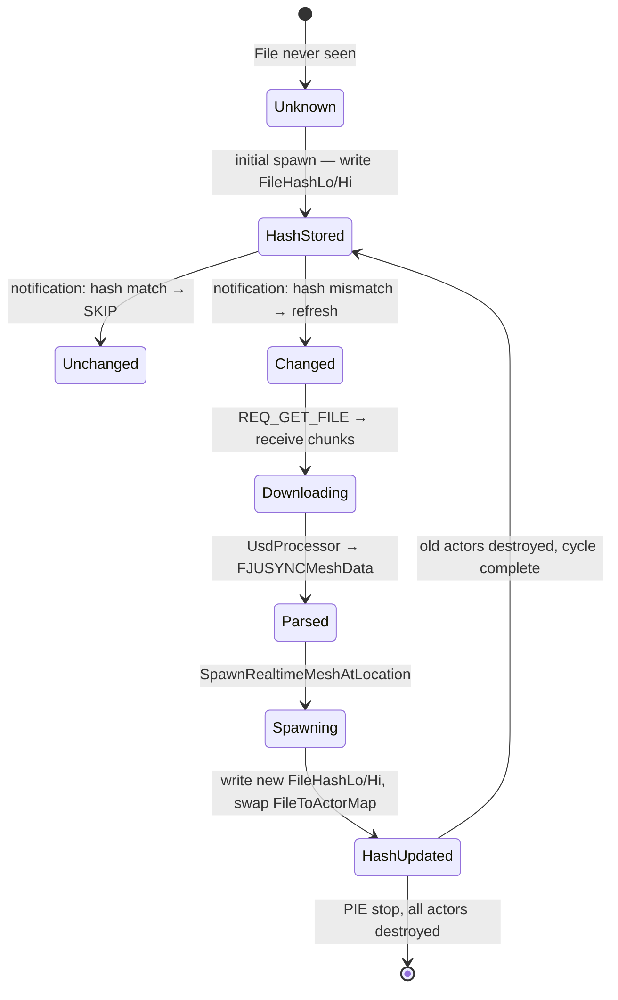
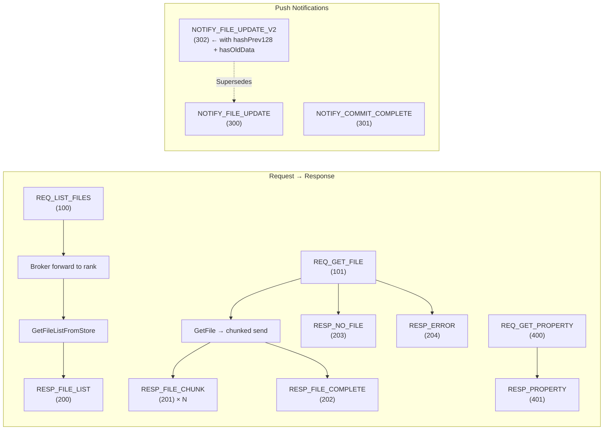
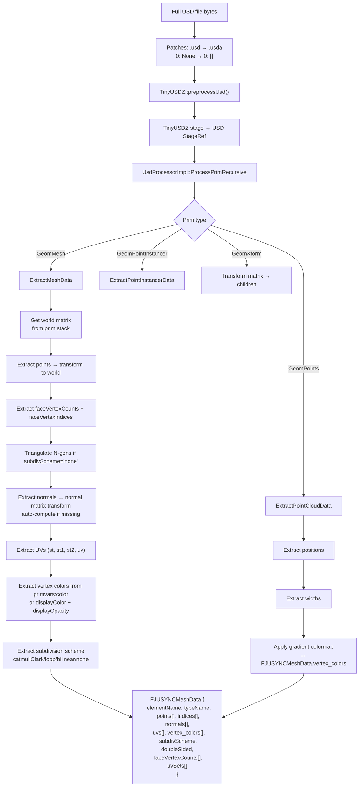
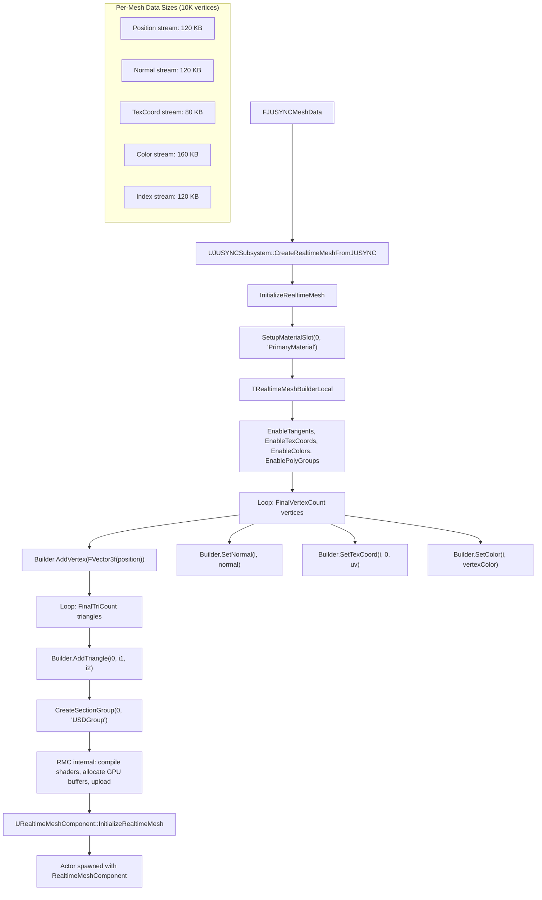
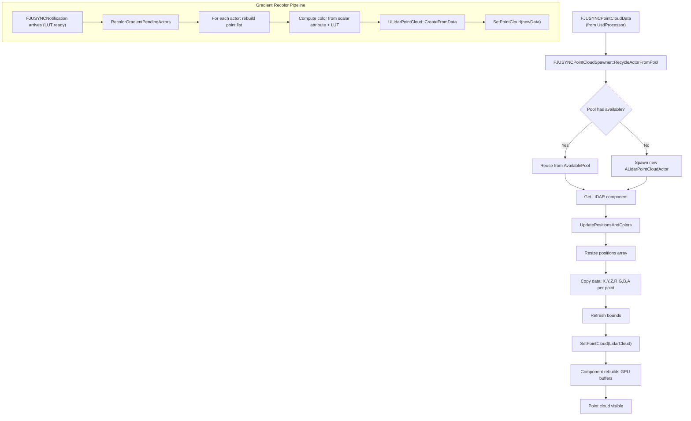

# Full Data Flow — HPC Worker → ANARI-USD → ZMQ Broker → JUSYNC Middleware → Unreal Engine

> Live-update mesh data pipeline from ParaView simulation ranks to RealtimeMeshComponent actors.
> Covers: DiffCapture (old-state tracking), V2 notifications, hash-based refresh, parallel downloads, USD parsing, GPU transforms, collision, and RMC in-place updates.

---

## Sequence Diagram — Frame Update Cycle (V2 with DiffCapture)

```mermaid
sequenceDiagram
    autonumber
    participant Sim as ParaView/Catalyst<br/>HPC Worker (rank N)
    participant USD as ANARI-USD SDK<br/>UsdDevice + UsdBridge
    participant DCF as DiffCapture<br/>(UsdBridgeDiffCapture singleton)
    participant MB as ZmqBroker<br/>Rank 0 MPI Broker
    participant MW as JUSYNC Middleware<br/>AnariUsdClient + Dispatcher
    participant UE as UE Spawner<br/>AJUSYNCFileSpawnerActor
    participant PC as UE PointCloud<br/>FJUSYNCPointCloudSpawner
    participant RMC as RMC Engine<br/>RealtimeMeshComponent

    Note over Sim,MB: ── Frame Boundary (each ParaView commit) ──

    Sim->>USD: flushCommit()<br/>UpdateUSDGeometry()
    USD->>USD: UsdBridgeUsdWriter::TrackStageMemory()<br/>ExportToString → fullUsdContent

    Note over DCF: 📸 DIFF-CAPTURE-HOOK
    USD->>DCF: CapturePreStore(filename)<br/>reads old FileEntry from MemoryStore
    DCF->>DCF: entries[filename] = { oldData, oldHash128[2], oldSize, oldTimestamp }

    USD->>USD: StoreFile(filename, newData)<br/>overwrites current FileEntry
    Note over USD: OLD DATA GONE here.<br/>DiffCapture holds it.

    USD->>USD: FlushSceneAndNotify()
    USD->>DCF: GetOldHash128(filename)<br/>HasOldEntry(filename)
    DCF-->>USD: oldHash128[2], hasOldData=true
    USD->>USD: SendFileNotificationV2(filename, newHash, oldHash, hasOldData)
    USD->>DCF: Commit(filename)<br/>clear captured state

    Note over MB: ── Broker Forwarding ──
    USD->>MB: NOTIFY_FILE_UPDATE_V2 (302)<br/>hashPrev128[2] + hasOldData

    MB->>MB: ForwardNotificationToClient()
    MB->>MW: ZMQ ROUTER → client identity<br/>+ empty frame + V2 notification payload

    Note over MW: ── Middleware Reception ──
    MW->>MW: dispatcherThread() polls ZMQ
    MW->>MW: isNotificationType(302) → true
    MW->>MW: handleNotification(data)
    MW->>MW: notifCallback(messageType, rank, filename,<br/>fileSize, timestamp, hashLo, hashHi,<br/>hashPrevLo, hashPrevHi, hasOldData)

    Note over UE: ── UE Game Thread (AsyncTask) ──
    MW->>UE: NotificationCallback_Static()<br/>marshal to game thread
    UE->>UE: FJUSYNCNotification broadcast<br/>OnNotificationReceived
    UE->>PC: OnBrokerNotification()
    UE->>RMC: OnBrokerNotification()

    Note over UE,PC: ── Hash-Guarded Decision ──
    UE->>UE: FileHashLo[filename] vs hashPrevLo/Hi
    alt Hash match (no change)
        UE->>UE: SKIP — no download, no destroy
    else Hash mismatch (changed)
        UE->>UE: RefreshSingleFile(filename, rank)
        UE->>MB: REQ_GET_FILE (101) → download new USD
        MB-->>MW: RESP_FILE_CHUNK (201) × N chunks
        MW-->>UE: Full file data
        UE->>USD: UsdProcessor::ExtractMeshData()<br/>TinyUSDZ stage + processPrim walk

        Note over UE,RMC: ── Mesh Spawn (spawn-then-destroy) ──
        UE->>UE: ParseMeshData → FJUSYNCMeshData
        UE->>RMC: SpawnRealtimeMeshAtLocation()<br/>old actor still visible
        RMC->>RMC: InitializeRealtimeMeshSimple()
        RMC->>RMC: Build vertex/index streams<br/>EnableColors/TexCoords/Normals/PolyGroups
        RMC->>RMC: CreateSectionGroup(0, "USDGroup")

        Note over UE: ── Gradient Recolor ──
        UE->>UE: DrainReadyQueue() complete
        UE->>UE: RecolorGradientPendingActors() if LUT pending

        UE->>UE: Update hash maps:
            FileHashLo[filename] = hashLo
            FileHashHi[filename] = hashHi
            FileLastSize[filename] = fileSize

        Note over UE: ── PC Update ──
        UE->>PC: RecycleActorFromPool or spawn new
        PC->>PC: UpdatePositionsAndColors()<br/>UpdateVertexAttributes()
        PC->>PC: SetPointCloud() → RefreshBounds()

        UE->>UE: Destroy old actors
    end
```

---

## File List Update Flow (Periodic Poll + Notification-Diff)

```mermaid
sequenceDiagram
    autonumber
    participant UE as AJUSYNCFileSpawnerActor
    participant MW as AnariUsdMiddleware
    participant MB as ZmqBroker
    participant W as Workers<br/>(rank 0..N-1)

    Note over UE,W: ── Periodic File List Poll (5-30s) ──

    UE->>MW: RequestFileListWithSizes<br/>target_rank = -1 (all ranks)
    MW->>MB: REQ_LIST_FILES + REQ_GET_FILE per rank
    MB->>W: Forward to each worker
    W->>W: GetFileListFromStore()<br/>ListFiles(), GetFile()
    W->>W: Compute hash128 per file
    W->>MW: RESP_FILE_LIST + JSON (names, sizes, timestamps, HashLo, HashHi)
    MW->>MW: Merge responses, dedup USD files
    MW->>UE: FileListWithSizesCallback(filteredFiles, filteredSizes,<br/>filteredTimestamps, filteredRanks,<br/>hashLo array, hashHi array)

    Note over UE: ── Hash-Based Diff ──
    UE->>UE: DiffAndRefreshFileList()
    UE->>UE: Compare NEW hashLo/Hi vs stored FileHashLo/Hi
    alt File NOT in stored hashes (new file)
        UE->>UE: Add to ChangedFiles, RefreshRemainingFiles
    else File hash changed (content updated)
        UE->>UE: Add to ChangedFiles, RefreshRemainingFiles
    else File hash unchanged
        UE->>UE: SKIP — no action needed

    Note over UE: ── Spawn/Refresh Cycle ──
    UE->>RMC: DrainReadyQueue() → spawn all new files
    UE->>RMC: RecolorGradient if LUT pending
```

---

## Parallel Download Pipeline (Multiple Files in Parallel)

```mermaid
graph TD
    A[UE: RequestFiles ParallelAsync] --> B[ParallelDownloadManager::requestFilesParallelAsync]
    B --> C[Scheduler: estimate bytes per file]

    C --> D[MemoryMonitor: canAlloc?]
    D --> E{RAM check}
    E -->|YES| F[MemoryMonitor.allocate(estimatedMB)]
    E -->|NO| G[Wait scheduler loop retry]

    F --> H[Worker thread: send REQ_GET_FILE]
    H --> I[Broker: forward to rank]
    I --> J[Worker: send RESP_FILE_CHUNK × N]
    I --> K[Worker: send RESP_FILE_COMPLETE]

    J --> L[Dispatcher: enqueue chunks to responseQueue]
    K --> L

    L --> M[Worker thread: accumulate chunks]
    M --> N{Complete?}
    N -->|No| O[waitForMatching → CV wait]
    N -->|Yes| P[accumulateChunkComplete]

    P --> Q[SpawnCallback → Async download parse]
    Q --> R[Parse on background thread]
    R --> S[Marshal to game thread]
    S --> T[SpawnRealtimeMeshAtLocation / UpdatePointCloud]
    T --> U[MemoryMonitor.release(actualSize)]

    subgraph "Thread Affinity"
        Scheduler1["Scheduler thread"]
        Dispatcher1["Dispatcher thread (owns recv)"]
        Worker1["Worker threads × N (send + accumulate)"]
        Game1["Game thread (spawn RMC/PC)"]
    end
```

---

## Hash Tracking Lifecycle (Per File)



---

## Data Structures — Key Maps & Queues

| Structure | Owner | Purpose |
|---|---|---|
| `TMap<FString, AActor*> FileToActorMap` | `AJUSYNCFileSpawnerActor` | Maps `"ElementName\|Filename"` → spawned Actor* |
| `TMap<FString, uint64> FileHashLo` | `AJUSYNCFileSpawnerActor` | Filename → hash128[0] (new data) |
| `TMap<FString, uint64> FileHashHi` | `AJUSYNCFileSpawnerActor` | Filename → hash128[1] (new data) |
| `TMap<FString, int64> FileLastSize` | `AJUSYNCFileSpawnerActor` | Filename → file size |
| `TArray<AActor*> SpawnedActors` | `AJUSYNCFileSpawnerActor` | Flat array of visible actors (for destruction) |
| `TArray<USceneComponent*> SpawnedComponents` | `AJUSYNCFileSpawnerActor` | RealtimeMeshComponents for cleanup |
| `TMap<FString, ALidarPointCloudActor*> FileToPCA Map` | `FJUSYNCPointCloudSpawner` | Point cloud actor map |
| `AvailablePool` | `FJUSYNCPointCloudSpawner` | Pool of reusable ALidarPointCloudActor* |
| `ParsePendingTasks` | `AJUSYNCFileSpawnerActor` | Queue of files awaiting background parse |
| `RetryRemainingFiles` | `AJUSYNCFileSpawnerActor` | Centralized retry queue (FailedFileIndices + ParseFailedIndices merged) |
| `TMap<FString, DiffFileEntry> entries_` | `UsdBridgeDiffCapture` | Old data before StoreFile overwrites |

---

## ZeroMQ Message Types (Complete Reference)



---

## Notification Payload — V2 Wire Format

```
ZmqFileNotification (packed, ~360 bytes):
┌─────────────────────┬───────────┐
│ magic (0x55534146)  │ uint32    │ "USDF"
│ message_type        │ uint32    │ 300=V1, 302=V2, 301=commit
│ source_rank         │ int32     │ worker MPI rank
│ filename [256]      │ char[]    │ relative path (null-terminated)
│ file_size           │ uint64    │ current file size in bytes
│ timestamp           │ uint64    │ Unix ms since epoch
│ hash128 [0]         │ uint64    │ XXH3-128 lo of NEW data
│ hash128 [1]         │ uint64    │ XXH3-128 hi of NEW data
│ hashPrev128[0]      │ uint64    │ XXH3-128 lo of OLD data (0 if first)
│ hashPrev128[1]      │ uint64    │ XXH3-128 hi of OLD data (0 if first)
│ hasOldData          │ bool      │ true if hashPrev128 is valid
└─────────────────────┴───────────┘
```

---

## USD Parsing Pipeline (File → FJUSYNCMeshData)



---

## RMC Building Pipeline (FJUSYNCMeshData → GPU Mesh)



---

## Point Cloud Pipeline



---

## Memory Layout — File Data Journey

```
HPC (rank N)                      Network                       JUSYNC Middleware
─────────────────                ──────────                    ─────────────────────
UsdBridgeUsdWriter                ──────────────>              AnariUsdClient
 │
 ├── UsdStage::ExportToString      NOTIFY_FILE_UPDATE_V2        │
 │   (fullASCII .usda)                (360 byte header)         dispatcher recv → queue
 │                                    (ZmqFileNotification)     │
 ├── StoreFile()                   ──────────────>              handleNotification()
 │    └── FileEntry                 RESP_FILE_CHUNK             │
 │        ├── uint8[] data           (4MB chunks)               notificationCallback()
 │        ├── hash128[2]             (ZmqFileChunk)            │  ↓
 │        ├── size, timestamp        ──────────────>            UE NotificationCallback_Static
 │
UsdBridgeDiffCapture          ────────────────>               OnNotificationReceived
 │                                       ZmqFileListResponse     broadcast → Blueprint
 ├── CapturePreStore()               (JSON: name, size,        │     ↓
 │    └── DiffFileEntry                   hash_lo, hash_hi)   OnBrokerNotification
 │        ├── oldData[]                ──────────────>         │     ↓
 │        ├── oldHash128[2]            (hash arrays)           [Hash compare]
 │        ├── oldSize, oldTimestamp    ──────────────>         │       ├── SKIP (match)
 │
 ├── Commit()                        (hashPrev128)             │       └── REFRESH (mismatch)
 │                                              ↓              │              ↓
UsdBridgeZmqBroker                   ──────────────>          ParallelDownload      UE
  ForwardNotificationToClient            RESP_WORKER_LIST      │                   FileToActorMap
  │                                          (rank, host,       │    ├── Spawn new actor
  └── ZMQ ROUTER                          identity, addr)      │    ├── Parse USD (bg thread)
      to all client IDs                                            ├── Update hash maps
                                                                   └── Destroy old actors
```

---

## DiffCapture Architecture (decoupled, 2 files)

```
ANARI-SDK (upstream)          Your files (maintained separately)         JUSYNC middleware
────────────────────────────    ──────────────────────────────────         ──────────────
UsdDevice.cpp                ─────┐                                     DiffCapture.h (copy)
 │                              ┌─┘                                     │
 ├── TrackStageMemory()  ──────┤    UsdBridgeDiffCapture.h              ─────  CapturePreStore()
 │     │                      │    ┌─────────────────────────────┐        │  │
 │     ├── CapturePreStore    │    │ class UsdBridgeDiffCapture  │        │  │
 │     │   │                  │    │ + CapturePreStore(filename) │        │  │
 │     │   └── GetFile() →    │    │ + GetOldEntry(file) → ptr   │        │  │
 │     │       DiffFileEntry  │    │ + GetOldHash128(file) → ptr │        │  │
 │     │                      │    │ + Commit(file)               │        │  │
 │     ├── StoreFile()        │    │ + Clear()                    │        │  │
 │     │                      │    │ + mutex, entries map         │        │  │
 │     └── GetFileList        │    │                              │        │  │
 │                            │    └─────────────────────────────┘        │  └──→ UE
 │                            │                                           │
 ├── FlushSceneAndNotify      └──── UsdBridgeDiffCapture.cpp            UE plugin
 │     │                        (singleton GetDiffCapture())              │
 │     ├── GetOldHash128                            ANARI-SDK build:   │
 │     ├── SendFileNotificationV2                   DiffCapture.cpp    │
 │     └── Commit                                   DiffCapture.h      │
 │                                                    ─────────────    │
SendFrameNotification ─────────────────────────────────────────────────┘
 │ (V2 notification, hashPrev128 populated)
 └──→ ZMQ broker ───→ JUSYNC client ───→ UE
```

---

## Edit Map — Where to Add Features

| Desired Change | Touch These Files | Why |
|---|---|---|
| Add new USD prim type | `UsdProcessor.cpp` (ExtractMeshData) | Parse new geometry attributes |
| Change hash algorithm | `xxhash/xxhash.c`, `HashVerifier.cpp` | All hash calls flow through HashVerifier |
| Add new ZMQ message type | `AnariUsdMessages.h` (ZmqMessageType enum) + `UsdBridgeZmqBroker.h` (struct) + `ZmqConnector.cpp` (routing) | Wire format + routing |
| Parallel download tuning | `ParallelDownloadManager.cpp` (scheduler + worker count) | Thread pool sizing |
| Gradient colormap change | `UsdProcessor.cpp` (ComputeGradientColor), `JUSYNCSubsystem.cpp` (RecolorGradientPendingActors) | Color computation |
| Mesh buffer update (in-place) | `JUSYNCBlueprintLibrary.cpp` (spawn mesh) | Build RMC streams |
| Hash comparison logic | `AJUSYNCFileSpawnerActor.cpp` (OnBrokerNotification, DiffAndRefreshFileList, RefreshSingleFile) | File update decisions |
| Diff capture depth | `UsdBridgeDiffCapture.cpp` (CapturePreStore) | Old data retention strategy |