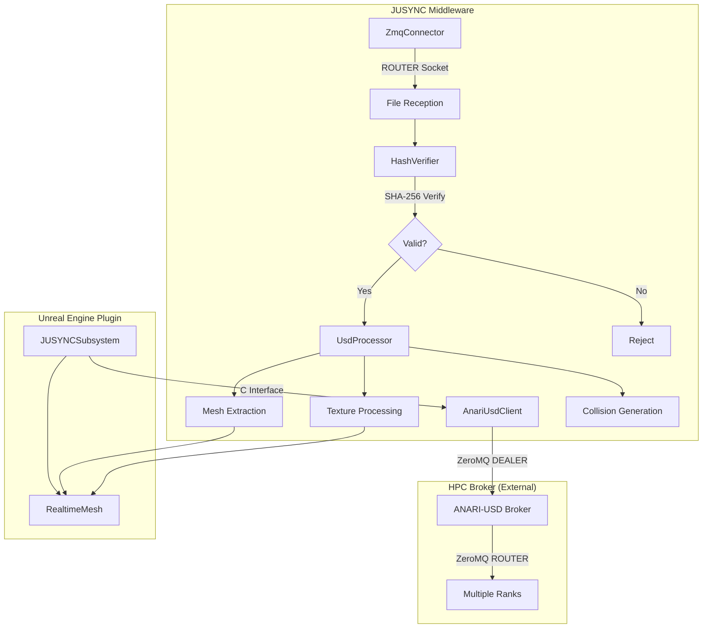
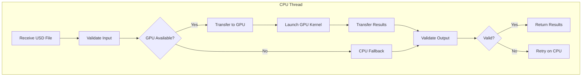

# GPU Acceleration Analysis for JUSYNC Middleware

## Executive Summary

This document provides a comprehensive analysis of the JUSYNC middleware codebase to identify components that could benefit from GPU acceleration. The analysis covers the current architecture, identifies CPU-bound operations suitable for GPU offloading, and outlines considerations for preserving existing retry logic and verification patterns.

---

## 1. Current Architecture Overview

### 1.1 High-Level Architecture



### 1.2 Core Components

| Component | File | Primary Function |
|-----------|------|------------------|
| [`AnariUsdMiddleware`](include/AnariUsdMiddleware.h) | Main public API with PIMPL pattern |
| [`ZmqConnector`](include/ZmqConnector.h) | ZeroMQ ROUTER/DEALER communication |
| [`UsdProcessor`](include/UsdProcessor.h) | USD file processing and mesh extraction |
| [`HashVerifier`](include/HashVerifier.h) | SHA-256 hash calculation and verification |
| [`CollisionProcessor`](include/CollisionProcessor.h) | Collision mesh generation |
| [`AnariUsdClient`](include/AnariUsdClient.h) | DEALER client for ANARI USD broker |

### 1.3 Data Flow

1. **File Reception**: ZeroMQ receives files from HPC broker
2. **Hash Verification**: SHA-256 verification ensures data integrity
3. **USD Processing**: TinyUSDZ parses USD files and extracts geometry
4. **Mesh Processing**: Vertex transformations, normal calculations, UV extraction
5. **Collision Generation**: Bounding box, convex hull, or simplified mesh generation
6. **Unreal Integration**: RealtimeMesh receives processed geometry data

---

## 2. CPU-Bound Operations Analysis

### 2.1 High-Priority GPU Candidates

#### 2.1.1 Vertex Transformations (HIGH PRIORITY)

**Location**: [`src/UsdProcessor.cpp:1294-1298`](src/UsdProcessor.cpp:1294)

```cpp
std::transform(std::execution::par,
              points.begin(), points.end(),
              outMeshData.points.begin(),
              transformVertex);
```

**Current Implementation**:
- Uses `std::execution::par` for CPU parallelization
- Applies 4x4 matrix transformation to each vertex
- Operation: `v' = M * v` (matrix-vector multiplication)

**Why GPU-Acceleratable**:
- **Embarrassingly parallel**: Each vertex transformation is independent
- **SIMD-friendly**: Matrix multiplication is ideal for GPU warps
- **High throughput**: Thousands to millions of vertices per mesh
- **Memory access pattern**: Sequential read/write, optimal for GPU coalescing

**Estimated Speedup**: 10-50x for meshes with >100K vertices

---

#### 2.1.2 Normal Calculations and Transformations (HIGH PRIORITY)

**Location**: [`src/UsdProcessor.cpp:1486-1490`](src/UsdProcessor.cpp:1486)

```cpp
std::transform(std::execution::par,
              normals.begin(), normals.end(),
              outMeshData.normals.begin(),
              transformNormal);
```

**Current Implementation**:
- Parallel CPU execution with `std::execution::par`
- Applies 3x3 normal matrix transformation
- Includes normalization (sqrt operation)

**Why GPU-Acceleratable**:
- **Independent operations**: Each normal can be processed independently
- **Mathematically intensive**: Normalization requires sqrt, ideal for GPU FP units
- **Batch processing**: All normals can be processed in a single kernel launch

**Estimated Speedup**: 15-60x for high-poly meshes

---

#### 2.1.3 UV Coordinate Processing (MEDIUM PRIORITY)

**Location**: [`src/UsdProcessor.cpp:2106-2112`](src/UsdProcessor.cpp:2106)

```cpp
std::transform(std::execution::par,
              uvs.begin(), uvs.end(),
              uvChannel.begin(),
              [](const tinyusdz::value::texcoord2f& uv) {
                  return glm::vec2(uv.s, uv.t);
              });
```

**Current Implementation**:
- Parallel CPU extraction from TinyUSDZ format
- Simple data copy with type conversion

**Why GPU-Acceleratable**:
- **Data parallel**: Each UV coordinate is independent
- **Memory bandwidth bound**: GPU memory controllers excel at this

**Estimated Speedup**: 5-20x (limited by memory bandwidth)

---

#### 2.1.4 UV Normalization (MEDIUM PRIORITY)

**Location**: [`src/UsdProcessor.cpp:1969-1981`](src/UsdProcessor.cpp:1969)

```cpp
std::for_each(std::execution::par, uvs.begin(), uvs.end(), [](glm::vec2& uv) {
    // Fast NaN/Inf check using integer representation
    const int32_t* ix = reinterpret_cast<const int32_t*>(&uv.x);
    const int32_t* iy = reinterpret_cast<const int32_t*>(&uv.y);
    if ((*ix & 0x7F800000) == 0x7F800000 || (*iy & 0x7F800000) == 0x7F800000) {
        uv = glm::vec2(0.0f, 0.0f);
    } else {
        uv.x = std::clamp(uv.x, -10.0f, 10.0f);
        uv.y = std::clamp(uv.y, -10.0f, 10.0f);
    }
});
```

**Current Implementation**:
- Bit-level NaN/Inf detection
- Clamping operations
- CPU parallel execution

**Why GPU-Acceleratable**:
- **Branch divergence manageable**: Most UVs are valid
- **SIMD clamping**: GPU has hardware clamping instructions

**Estimated Speedup**: 5-15x

---

### 2.2 Medium-Priority GPU Candidates

#### 2.2.1 SHA-256 Hash Calculation (MEDIUM PRIORITY)

**Location**: [`src/HashVerifier.cpp`](src/HashVerifier.cpp)

**Current Implementation**:
- OpenSSL-based SHA-256 implementation
- Sequential CPU processing
- Streaming hash for large files

**Why GPU-Acceleratable**:
- **Parallel hash computation**: Multiple file chunks can be hashed in parallel
- **Fixed iteration count**: SHA-256 rounds are predictable
- **Large file optimization**: Files >10MB benefit significantly

**Challenges**:
- **Small file overhead**: GPU launch overhead may exceed CPU time for small files
- **OpenSSL integration**: Need GPU-compatible hash implementation (e.g., CUDA SHA-256)

**Estimated Speedup**: 2-10x for files >100MB

---

#### 2.2.2 Collision Mesh Generation (MEDIUM PRIORITY)

**Location**: [`src/CollisionProcessor.cpp:227-462`](src/CollisionProcessor.cpp:227)

**Current Implementation**:
- Bounding box calculation (iterative min/max)
- Convex hull generation (CPU-based algorithm)
- Mesh decimation for simplified collision

**Why GPU-Acceleratable**:
- **Bounding box**: Parallel reduction for min/max
- **Convex hull**: GPU algorithms available (e.g., QuickHull GPU)
- **Mesh decimation**: Parallel edge collapse evaluation

**Estimated Speedup**: 5-30x for complex collision meshes

---

#### 2.2.3 Image/Texture Processing (MEDIUM PRIORITY)

**Location**: [`src/UsdProcessor.cpp`](src/UsdProcessor.cpp) - Texture processing methods

**Current Implementation**:
- STB image library for decoding
- Gradient line extraction
- PNG encoding

**Why GPU-Acceleratable**:
- **Image decoding**: GPU texture decompression
- **Color space conversion**: Parallel pixel processing
- **Resampling**: GPU texture sampling

**Estimated Speedup**: 3-15x for high-resolution textures

---

### 2.3 Low-Priority GPU Candidates

#### 2.3.1 USD File Parsing (LOW PRIORITY)

**Location**: TinyUSDZ library (external)

**Current Implementation**:
- Sequential file parsing
- JSON-like text parsing for .usda files
- Binary parsing for .usdc/.usdz files

**Why NOT GPU-Acceleratable**:
- **Sequential dependencies**: Parsing has inherent sequential nature
- **String operations**: Not GPU-friendly
- **Complex control flow**: Branch-heavy code

**Recommendation**: Keep on CPU

---

#### 2.3.2 ZeroMQ Network Communication (NOT GPU-ACCELERATABLE)

**Location**: [`src/ZmqConnector.cpp`](src/ZmqConnector.cpp)

**Why NOT GPU-Acceleratable**:
- **Network I/O bound**: GPU cannot accelerate network operations
- **Protocol overhead**: ZeroMQ framing is CPU operation

**Recommendation**: Keep on CPU

---

## 3. Components That Should Remain CPU-Based

| Component | Reason |
|-----------|--------|
| ZeroMQ Communication | Network I/O bound, protocol handling |
| USD File Parsing | Sequential dependencies, string operations |
| File System Operations | OS-level I/O, not GPU-acceleratable |
| Callback Management | Control flow, event handling |
| Memory Allocation | CPU-managed memory, GPU requires explicit transfer |
| Error Handling | Control flow, logging |
| Configuration Management | Small data, frequent access |

---

## 4. Retry Logic and Verification Patterns

### 4.1 Existing Retry Logic

#### 4.1.1 File List Request Retry

**Location**: [`src/AnariUsdClient.cpp:703-843`](src/AnariUsdClient.cpp:703)

```cpp
if (!isSingleRankMode && respondedCount < static_cast<int32_t>(totalWorkers)) {
    // Retry each missing rank
    int32_t retryTimeout = timeoutMs / 3;
    for (int32_t rank = 0; rank < static_cast<int32_t>(totalWorkers); ++rank) {
        if (!responded[rank]) {
            // Retry logic for missing ranks
        }
    }
}
```

**Preservation Requirements**:
- Retry logic must remain on CPU (network operation)
- GPU operations should not interfere with retry counting
- Timeout handling must be preserved

---

#### 4.1.2 Connection Retry

**Location**: [`src/AnariUsdClient.cpp:30-122`](src/AnariUsdClient.cpp:30)

```cpp
bool AnariUsdClient::connect(const char* brokerEndpoint, int timeoutMs) {
    // Connection with timeout validation
    // Cleanup on failure
}
```

**Preservation Requirements**:
- Connection state management on CPU
- GPU resources must be cleaned up on disconnection

---

### 4.2 Existing Verification Patterns

#### 4.2.1 Hash Verification

**Location**: [`src/HashVerifier.cpp`](src/HashVerifier.cpp)

```cpp
bool HashVerifier::verifyHash(const std::vector<uint8_t>& data, const std::string& expectedHash) {
    std::string calculatedHash = calculateSHA256(data);
    return constantTimeCompare(calculatedHash, expectedHash);
}
```

**Preservation Requirements for GPU Implementation**:
- **Deterministic output**: GPU hash must produce identical results to CPU
- **Verification step**: CPU must verify GPU hash results
- **Fallback mechanism**: CPU hash as fallback if GPU fails

---

#### 4.2.2 Mesh Data Validation

**Location**: [`src/UsdProcessor.cpp`](src/UsdProcessor.cpp) - Multiple locations

```cpp
// Bounds checking
if (vertexCount > safety::MAX_MESH_VERTICES) {
    return false;
}

// Finite value validation
if (!std::isfinite(value)) {
    // Handle invalid value
}
```

**Preservation Requirements for GPU Implementation**:
- **Post-processing validation**: CPU must validate GPU output
- **NaN/Inf handling**: GPU kernels must handle edge cases
- **Bounds checking**: GPU must respect size limits

---

#### 4.2.3 Transform Validation

**Location**: [`src/UsdProcessor.cpp`](src/UsdProcessor.cpp)

```cpp
// Matrix determinant checking
float det = glm::determinant(transformMatrix);
if (std::abs(det) < 1e-10f) {
    // Singular matrix - reject
}
```

**Preservation Requirements for GPU Implementation**:
- **Pre-processing validation**: Validate matrices before GPU transfer
- **Post-processing validation**: Check transformed vertices for validity

---

## 5. GPU Acceleration Integration Strategy

### 5.1 Recommended GPU Framework

| Framework | Pros | Cons | Recommendation |
|-----------|------|------|----------------|
| **CUDA** | Best performance, mature ecosystem | NVIDIA-only | Primary choice for NVIDIA GPUs |
| **SYCL** | Cross-vendor, C++ standard | Less mature | Alternative for AMD/Intel |
| **Vulkan Compute** | Cross-platform, low-level | Complex API | For maximum portability |
| **OpenCL** | Cross-vendor, mature | Deprecated by Apple | Legacy support only |

**Recommendation**: CUDA for initial implementation, with SYCL abstraction layer for future cross-vendor support.

---

### 5.2 Integration Architecture



### 5.3 Memory Management Strategy

```cpp
// Recommended pattern for GPU acceleration
class GpuAcceleratedProcessor {
private:
    // GPU buffers
    cudaDevicePtr d_vertices;
    cudaDevicePtr d_normals;
    cudaDevicePtr d_output_vertices;
    cudaDevicePtr d_output_normals;
    
    // Stream for async operations
    cudaStream_t processingStream;
    
public:
    // Process with GPU, fallback to CPU on error
    bool processMesh(const MeshData& input, MeshData& output) {
        // 1. Validate input (CPU)
        if (!validateInput(input)) {
            return false;
        }
        
        // 2. Try GPU processing
        if (tryGpuProcessing(input, output)) {
            // 3. Validate GPU output (CPU)
            if (validateOutput(output)) {
                return true;
            }
        }
        
        // 4. Fallback to CPU
        MIDDLEWARE_LOG_INFO("GPU processing failed, falling back to CPU");
        return cpuFallbackProcessing(input, output);
    }
};
```

---

### 5.4 Error Handling Pattern

```cpp
// GPU operation with retry and fallback
template<typename GpuOp, typename CpuFallback>
bool gpuWithFallback(const char* operationName, GpuOp gpuOp, CpuFallback cpuFallback) {
    // Attempt GPU operation
    cudaError_t err = gpuOp();
    if (err == cudaSuccess) {
        // Check for async errors
        err = cudaStreamSynchronize(processingStream);
        if (err == cudaSuccess) {
            MIDDLEWARE_LOG_INFO("GPU %s completed successfully", operationName);
            return true;
        }
    }
    
    // Log GPU error
    MIDDLEWARE_LOG_WARNING("GPU %s failed: %s, falling back to CPU", 
                          operationName, cudaGetErrorString(err));
    
    // Fallback to CPU
    return cpuFallback();
}
```

---

## 6. Specific GPU Kernel Recommendations

### 6.1 Vertex Transformation Kernel

```cuda
__global__ void transformVerticesKernel(
    const float3* __restrict__ inputVertices,
    const float* __restrict__ transformMatrix,  // 4x4 matrix, row-major
    float3* __restrict__ outputVertices,
    size_t vertexCount)
{
    size_t idx = blockIdx.x * blockDim.x + threadIdx.x;
    if (idx >= vertexCount) return;
    
    float3 v = inputVertices[idx];
    
    // 4x4 matrix multiplication (unrolled for performance)
    float x = transformMatrix[0] * v.x + transformMatrix[4] * v.y + 
              transformMatrix[8] * v.z + transformMatrix[12];
    float y = transformMatrix[1] * v.x + transformMatrix[5] * v.y + 
              transformMatrix[9] * v.z + transformMatrix[13];
    float z = transformMatrix[2] * v.x + transformMatrix[6] * v.y + 
              transformMatrix[10] * v.z + transformMatrix[14];
    
    outputVertices[idx] = make_float3(x, y, z);
}
```

### 6.2 Normal Transformation Kernel

```cuda
__global__ void transformNormalsKernel(
    const float3* __restrict__ inputNormals,
    const float* __restrict__ normalMatrix,  // 3x3 matrix, row-major
    float3* __restrict__ outputNormals,
    size_t normalCount)
{
    size_t idx = blockIdx.x * blockDim.x + threadIdx.x;
    if (idx >= normalCount) return;
    
    float3 n = inputNormals[idx];
    
    // 3x3 matrix multiplication
    float x = normalMatrix[0] * n.x + normalMatrix[3] * n.y + normalMatrix[6] * n.z;
    float y = normalMatrix[1] * n.x + normalMatrix[4] * n.y + normalMatrix[7] * n.z;
    float z = normalMatrix[2] * n.x + normalMatrix[5] * n.y + normalMatrix[8] * n.z;
    
    // Normalization
    float len = rsqrtf(x * x + y * y + z * z);
    // Handle zero-length normals
    len = (len > 0) ? len : 1.0f;
    
    outputNormals[idx] = make_float3(x * len, y * len, z * len);
}
```

### 6.3 Bounding Box Reduction Kernel

```cuda
__global__ void boundingBoxStepKernel(
    const float3* __restrict__ vertices,
    float3* __restrict__ localMins,
    float3* __restrict__ localMaxs,
    size_t vertexCount,
    size_t blockSize)
{
    __shared__ float3 sharedMin;
    __shared__ float3 sharedMax;
    
    size_t idx = blockIdx.x * blockDim.x + threadIdx.x;
    size_t tid = threadIdx.x;
    
    // Initialize shared memory
    if (tid == 0) {
        sharedMin = make_float3(INFINITY, INFINITY, INFINITY);
        sharedMax = make_float3(-INFINITY, -INFINITY, -INFINITY);
    }
    __syncthreads();
    
    // Strided loop for all vertices
    float3 localMin = make_float3(INFINITY, INFINITY, INFINITY);
    float3 localMax = make_float3(-INFINITY, -INFINITY, -INFINITY);
    
    for (size_t i = idx; i < vertexCount; i += blockDim.x * gridDim.x) {
        float3 v = vertices[i];
        localMin = fminf(localMin, v);
        localMax = fmaxf(localMax, v);
    }
    
    // Shared reduction
    sharedMin = fminf(sharedMin, localMin);
    sharedMax = fmaxf(sharedMax, localMax);
    __syncthreads();
    
    // Write block result
    if (tid == 0) {
        localMins[blockIdx.x] = sharedMin;
        localMaxs[blockIdx.x] = sharedMax;
    }
}
```

---

## 7. Performance Considerations

### 7.1 When GPU Acceleration Helps

| Scenario | Benefit | Reason |
|----------|---------|--------|
| Large meshes (>100K vertices) | High | Amortizes GPU launch overhead |
| Batch processing | High | Multiple meshes in single kernel |
| Complex transformations | High | More computation per vertex |
| High-resolution textures | Medium | Memory bandwidth advantage |
| Large files (>100MB) hashing | Medium | Parallel chunk hashing |

### 7.2 When GPU Acceleration Hurts

| Scenario | Reason |
|----------|--------|
| Small meshes (<1K vertices) | GPU launch overhead exceeds CPU time |
| Single operations | Memory transfer dominates |
| Branch-heavy operations | GPU warp divergence |
| Random memory access | Poor GPU memory coalescing |

### 7.3 Recommended Thresholds

```cpp
// Minimum sizes for GPU acceleration
constexpr size_t MIN_VERTICES_FOR_GPU = 10000;
constexpr size_t MIN_FILE_SIZE_FOR_GPU_HASH = 10 * 1024 * 1024;  // 10MB
constexpr size_t MIN_TEXTURE_PIXELS_FOR_GPU = 1024 * 1024;  // 1MP
```

---

## 8. Implementation Roadmap

### Phase 1: Foundation (Recommended First Steps)

1. **Add CUDA detection and initialization**
   - Detect available GPUs
   - Create CUDA context
   - Error handling infrastructure

2. **Implement vertex transformation kernel**
   - Highest impact, lowest complexity
   - Clear fallback to CPU

3. **Add validation infrastructure**
   - Post-GPU output validation
   - CPU fallback on validation failure

### Phase 2: Core Processing

4. **Implement normal transformation kernel**
   - Similar pattern to vertex transformation
   - Combined kernel option for vertices + normals

5. **Implement UV processing kernel**
   - Lower priority but straightforward

6. **Add batch processing support**
   - Process multiple meshes in single kernel launch

### Phase 3: Advanced Features

7. **Implement GPU hash verification**
   - For large files only
   - Careful validation required

8. **Implement collision generation kernels**
   - Bounding box reduction
   - Convex hull (complex)

9. **Add texture processing kernels**
   - Image decoding (if using GPU-capable decoder)
   - Color space conversion

### Phase 4: Optimization

10. **Unified memory for simplicity**
    - Or pinned host memory for performance

11. **Stream overlap**
    - Overlap GPU processing with CPU work

12. **MIP mapping for textures**
    - GPU-based MIP generation

---

## 9. Testing Strategy

### 9.1 Correctness Testing

```cpp
// Compare GPU vs CPU results
bool validateGpuResults(const MeshData& cpuResult, const MeshData& gpuResult) {
    // Vertex comparison with tolerance
    for (size_t i = 0; i < cpuResult.points.size(); i += 3) {
        float dx = std::abs(cpuResult.points[i] - gpuResult.points[i]);
        float dy = std::abs(cpuResult.points[i+1] - gpuResult.points[i+1]);
        float dz = std::abs(cpuResult.points[i+2] - gpuResult.points[i+2]);
        
        if (dx > 1e-5f || dy > 1e-5f || dz > 1e-5f) {
            MIDDLEWARE_LOG_ERROR("Vertex mismatch at index %zu", i/3);
            return false;
        }
    }
    return true;
}
```

### 9.2 Performance Testing

- Benchmark with varying mesh sizes
- Measure CPU vs GPU time
- Identify break-even points
- Profile memory transfer overhead

---

## 10. Conclusion

### 10.1 Summary of GPU Acceleration Opportunities

| Component | Priority | Estimated Speedup | Implementation Complexity |
|-----------|----------|-------------------|--------------------------|
| Vertex Transformations | HIGH | 10-50x | Low |
| Normal Transformations | HIGH | 15-60x | Low |
| UV Processing | MEDIUM | 5-20x | Low |
| SHA-256 Hashing | MEDIUM | 2-10x | Medium |
| Collision Generation | MEDIUM | 5-30x | High |
| Texture Processing | MEDIUM | 3-15x | Medium |
| USD Parsing | LOW | N/A | Not recommended |

### 10.2 Key Recommendations

1. **Start with vertex/normal transformations** - Highest impact, lowest risk
2. **Implement robust CPU fallback** - Essential for reliability
3. **Add comprehensive validation** - Preserve existing verification patterns
4. **Use size thresholds** - Only use GPU for sufficiently large data
5. **Maintain retry logic** - GPU failures should trigger CPU fallback, not retry

### 10.3 Risk Mitigation

- **Always validate GPU output** on CPU before use
- **Maintain CPU implementation** as fallback
- **Log all GPU operations** for debugging
- **Test with diverse mesh data** including edge cases
- **Monitor GPU memory** to prevent OOM conditions

---

## Appendix A: File References

### Core Files Analyzed

| File | Lines Analyzed | Key Findings |
|------|----------------|--------------|
| [`include/AnariUsdMiddleware.h`](include/AnariUsdMiddleware.h) | Full | Main API, PIMPL pattern |
| [`include/UsdProcessor.h`](include/UsdProcessor.h) | Full | Mesh processing interface |
| [`src/UsdProcessor.cpp`](src/UsdProcessor.cpp) | 1294-1298, 1486-1490, 1969-1981, 2106-2112 | Parallel CPU operations |
| [`include/HashVerifier.h`](include/HashVerifier.h) | Full | SHA-256 verification |
| [`include/CollisionProcessor.h`](include/CollisionProcessor.h) | Full | Collision generation |
| [`src/CollisionProcessor.cpp`](src/CollisionProcessor.cpp) | 227-462 | Bounding box, convex hull |
| [`src/AnariUsdClient.cpp`](src/AnariUsdClient.cpp) | 703-843 | Retry logic |
| [`UnrealPlugin/JUSYNC/Source/JUSYNC/Private/JUSYNCSubsystem.cpp`](UnrealPlugin/JUSYNC/Source/JUSYNC/Private/JUSYNCSubsystem.cpp) | 202-423 | Mesh conversion |

### External Dependencies

| Library | GPU Support | Notes |
|---------|-------------|-------|
| GLM | No | CPU math library |
| TinyUSDZ | No | CPU parsing |
| STB | Limited | Some GPU variants exist |
| OpenSSL | No | CPU crypto |
| ZeroMQ | No | Network library |

---

*Document generated: 2024-01-XX*
*Analysis based on JUSYNC Middleware v1.0.1*
