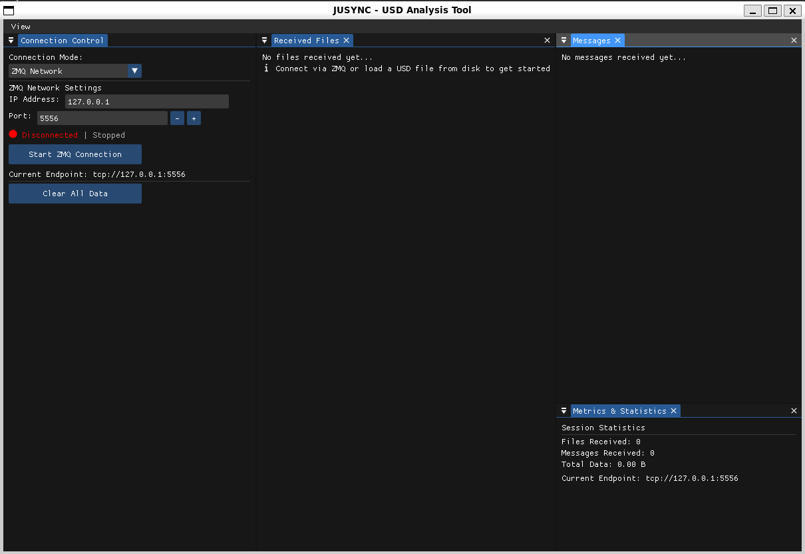

# JUSYNC ReceiverUI

A modern, cross-platform Dear ImGui-based graphical user interface for the JUSYNC USD Middleware. ReceiverUI provides real-time visualization, analysis, and export of USD files received over ZeroMQ or loaded directly from disk.



---

## How to Enable the GUI

To build and use the GUI application, enable it from the **root CMakeLists.txt** of your project by setting:

```

cmake .. -DBUILD_JUSYNC_Receiver_GUI=ON

```

This will configure and build the GUI as `ReceiverUI` in the `tools/ReceiverUI` directory. The build system is fully dynamic and supports both Windows and Linux, automatically detecting or allowing you to specify paths for dependencies like GLFW and GLEW.

---

## ⚠️ Note on ImGui Submodule and Docking Branch

### Why You Might See Build Errors Like:
error: ‘ImGuiConfigFlags_DockingEnable’ was not declared in this scope
error: ‘DockSpace’ is not a member of ‘ImGui’
...
Submodule path 'external/imgui': checked out '842837e35b421a4c85ca30f6840321f0a3c5a029'


### Explanation

By default, Git submodules track a **specific commit**, not a branch—even if your `.gitmodules` specifies `branch = docking` for ImGui.  
This means that after cloning or updating submodules, ImGui will be in a "detached HEAD" state at the commit your main repo references, and **not necessarily on the `docking` branch** (which is required for ReceiverUI's docking and multi-viewport features).

### How to Fix

If you encounter errors about missing ImGui docking symbols, **manually switch ImGui to the docking branch and update the submodule reference**:

```
cd external/imgui/ && git checkout docking
```


## Feature Checklist

### ✅ Available

- [x] **ZeroMQ Network Mode**: Connect to remote USD data streams over TCP
- [x] **Disk Loading Mode**: Load USD files directly from the filesystem
- [x] **Interactive USD Hierarchy**: Tree view of USD prims with type information and icons
- [x] **Mesh Data Inspector**: Detailed vertex, triangle, normal, and UV coordinate analysis
- [x] **Bounding Box & Memory Calculation**: Geometry bounds and memory usage
- [x] **Real-time Metrics**: Files received, throughput, session time
- [x] **SHA-256 Hash Verification**: For file integrity (network mode)
- [x] **Customizable Themes & Accent Colors**: Light/dark mode, color swatches, presets
- [x] **Dockable Panels & Multi-Viewport**: Flexible layout, multi-monitor support
- [x] **Export Capabilities**: TXT, CSV, and JSON export of analysis and mesh data
- [x] **Font Awesome Icons**: Consistent, professional iconography
- [x] **Threaded Analysis**: Non-blocking mesh extraction and statistics
- [x] **Detailed Logging**: Session messages, errors, and operations

### 🚧 Work in Progress

- [ ] **Speed Metrics**: time to receive and process the whole data

---

## Building ReceiverUI

### Prerequisites

**Windows:**
- Visual Studio 2019 or later
- CMake 3.16+
- GLFW3 (configurable path, defaults to `C:/SDK/glfw`)
- GLEW (configurable path, defaults to `C:/SDK/glew`)
- OpenGL 3.3+ drivers

**Linux:**
- GCC 7+ or Clang 6+
- CMake 3.16+
- GLFW (`libglfw3-dev`)
- GLEW (`libglew-dev`)
- OpenGL (`libgl1-mesa-dev`)

### Build Steps

```


# From the project root:

cmake .. -DBUILD_JUSYNC_Receiver_GUI=ON
cmake --build . --config Release

# Or build just the GUI (from tools/ReceiverUI):

cd tools/ReceiverUI
mkdir build \&\& cd build
cmake .. -DCMAKE_BUILD_TYPE=Release
cmake --build . --config Release

```

**Dependency Paths:**  
Override with environment variables or CMake flags if needed:
```

cmake .. -DGLFW_ROOT=/custom/glfw/path -DGLEW_ROOT=/custom/glew/path

```

---

## Usage

### Connection Modes

- **ZeroMQ Network**: Enter IP and port, click "Start ZMQ Connection" to receive files in real time.
- **Disk Loading**: Browse or enter a USD file path, click "Load USD File" to analyze directly.

### Analysis Workflow

1. **Receive or Load File**: Files appear in the file list with type, size, and hash.
2. **Select File**: Click to view details and start analysis.
3. **Analyze**: Click "Analyze USD File" for mesh extraction and statistics.
4. **Explore Results**: Use tabs for Summary, Hierarchy, Mesh Details, and Export.
5. **Export**: Save analysis as TXT, CSV, or JSON.

### UI Customization

- **Themes**: Toggle light/dark mode, pick accent colors, or use presets.
- **Layout**: Dock, undock, and rearrange panels; supports multi-monitor.
- **Font Awesome**: Icons auto-load from several common paths; falls back to text if not found.

---

## Example Workflow

1. **Start GUI**: Run `ReceiverUI` after building.
2. **Choose Connection Mode**: ZMQ for network, Disk for local files.
3. **Receive/Load USD**: File appears in the list.
4. **Analyze**: Click to analyze, view mesh stats, hierarchy, and details.
5. **Export Data**: Use Export tab for TXT/CSV/JSON.

---

## Troubleshooting

- **GLFW/GLEW Not Found**: Install the packages or set `GLFW_ROOT`/`GLEW_ROOT`.
- **Font Awesome Icons Missing**: Check the font paths in the `main.cpp` or place the font in `fonts/fa-solid-900.ttf`.

---

## License

ReceiverUI uses:
- **Dear ImGui**: MIT License
- **GLFW**: zlib/libpng License
- **GLEW**: BSD/MIT/Khronos License
- **Font Awesome**: SIL OFL 1.1 (fonts), MIT License (code)
- **JUSYNC Middleware**: See main project license

---


